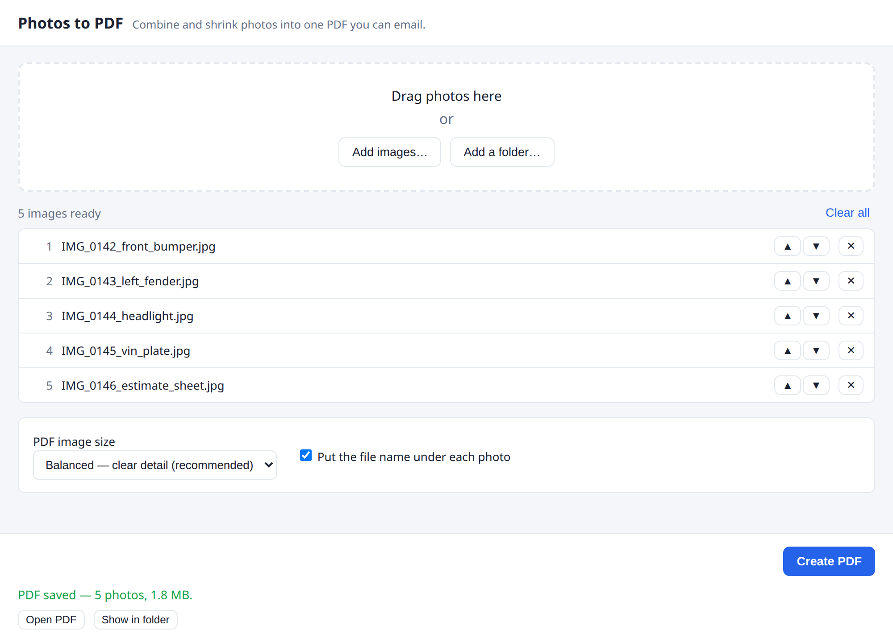

<div align="center">

# Photos to PDF

**Combine a pile of photos — and your existing PDFs — into one small, emailable PDF.**

Drag in your images and any PDFs (estimates, invoices, reports), pick a size, get a
single compressed document. No internet, no account, no upload. Everything happens
on your computer.



</div>

---

## Why

Phone photos are huge. A single 12‑megapixel shot is often 8–12 MB, and email
providers cap a message around 25 MB — so you can't attach more than a few before
it bounces. **Photos to PDF** shrinks each image (a damage photo becomes a few
hundred KB and is still perfectly legible) and bundles them into one PDF you can
actually send.

It started as a feature inside a body‑shop management app and was pulled out into
this standalone tool so it works anywhere, on any folder of images.

## Features

- **Drag & drop**, or add individual files or a whole folder.
- **Mix photos and PDFs** — drop an estimate in front of the damage photos and ship
  one document.
- **Reads what your phone and camera actually produce** — iPhone **HEIC**, **AVIF**,
  **WebP**, **camera RAW** (CR2/CR3, NEF, ARW, DNG, ORF, RAF, RW2 and friends) and
  **multi-page TIFF** scans, alongside the usual JPEG and PNG.
- **Reorder** everything and remove any you don't want before exporting.
- **Three size presets** — pick the balance of quality vs. file size you need.
- **One photo per page**, auto‑oriented (sideways phone photos come out upright),
  with the file name printed underneath (optional).
- **PDFs pass through untouched** — every page, at its original size and rotation,
  with its text still selectable and searchable. Nothing is re‑compressed.
- **Completely offline.** Your photos never leave the machine.
- **Cross‑platform** — Windows and Linux.

### Photo formats

| | Formats |
| --- | --- |
| **Everyday** | JPEG, PNG, GIF, BMP, TIFF |
| **Phone & modern web** | HEIC / HEIF (iPhone), HIF (Canon, Sony), AVIF, WebP |
| **Camera RAW** | CR2, CR3, NEF, NRW, ARW, SR2, DNG, ORF, RAF, RW2, PEF, SRW, 3FR, IIQ, MRW, X3F, … |
| **Everything else** | PSD, multi-page TIFF, TGA, QOI, PNM/PBM/PGM/PPM, ICO |
| **Documents** | PDF (copied through untouched) |

Two things worth knowing:

- **Camera RAW uses the full-size JPEG preview** your camera embedded in the file,
  not a fresh RAW conversion. That's the same picture you see on the camera's
  screen — with the camera's own white balance and picture style baked in.
- **A multi-page TIFF becomes multiple pages**, in order, each captioned with its
  page number. Scanners and fax software produce these.

Not supported: JPEG XL, JPEG 2000 and SVG. They're recognised and reported as
skipped rather than silently failing.

### Size presets

| Preset | Longest edge | Roughly per photo | Photos under a 25 MB email |
| --- | --- | --- | --- |
| Smaller files | 1200 px | 150–300 KB | ~50+ |
| **Balanced** (default) | 1600 px | 300–600 KB | ~25–40 |
| Higher detail | 2048 px | 700 KB–1.2 MB | ~12–18 |

## Download & install

Grab the latest build from the [**Releases**](../../releases) page.

- **Windows** — run `Photos to PDF Setup <version>.exe` to install, or use the
  `Photos to PDF <version>.exe` **portable** version (no install, just run it).
  > The app is currently **unsigned**, so Windows SmartScreen may warn about an
  > "unknown publisher" the first time. Click **More info → Run anyway**.
- **Linux** — download the `.AppImage`, make it executable (`chmod +x`), and
  double‑click or run it. Nothing to install.

## Using it

1. Launch the app.
2. Drag photos and PDFs onto the window, or use **Add files…** / **Add a folder…**.
3. Reorder with ▲ ▼, remove anything with ✕. Each row is tagged **PHOTO** or **PDF**
   so you can see what you're shipping.
4. Choose a **PDF image size** (Balanced is a good default). This only affects
   photos — added PDFs are never touched.
5. Click **Create PDF** and choose where to save it.
6. **Open PDF** or **Show in folder** — done.

Missing or unreadable files are skipped and reported with the reason; they won't
stop the rest. Password‑protected PDFs can't be merged — remove the password first.

A **multi-page TIFF** turns into one PDF page per TIFF page, and a **camera RAW**
file uses the full‑size JPEG preview the camera stored inside it.

## Build from source

Requires [Node.js](https://nodejs.org/) 18+.

```bash
npm install         # install dependencies
npm start           # run the app locally (needs a desktop)
npm test            # verify the image→PDF core, no GUI
```

Build installers:

```bash
npm run dist:linux  # → dist/Photos to PDF-<ver>.AppImage
npm run dist:win    # → dist/Photos to PDF Setup <ver>.exe  + portable .exe
npm run dist        # both
```

electron‑builder can build the **Windows** installers from Linux too — it bundles
its own NSIS, so no Wine is needed for an unsigned build. Signed builds require a
code‑signing certificate.

## How it works

```
src/
  pdfBuilder.js      core: photos + PDFs → one PDF (jimp + pdf-lib)
  decode/            reading images: one dispatcher, one module per format family
    index.js           sniff → decode → bitmaps (with the decoder contract)
    sniff.js           what is this file, really? (magic bytes, not the extension)
    heif.js            HEIC / HEIF / AVIF        webp.js    WebP
    rawPreview.js      camera RAW previews       tiff.js    multi-page TIFF
    psd.js             Photoshop composites      simple.js  TGA, QOI, PNM, ICO
  main.js            Electron main process: window, file dialogs, save
  preload.js         the only bridge the UI has to the system (locked down)
  renderer/          the interface (index.html + renderer.js)
test/                headless checks of the core and every decoder, no GUI
```

Files are identified by **their contents, not their extension** — a `.jpg` that is
really a PNG, or an Android `.heic` that is really AVIF, both still work. Each
format family gets its own small decoder behind one contract, and unknown files
fall back to hunting for an embedded JPEG preview, which is what makes most
oddball camera formats work without special-casing them.

The whole pipeline is **pure JavaScript and WebAssembly** —
[`jimp`](https://github.com/jimp-dev/jimp) downscales and re‑encodes each photo
(and applies EXIF rotation), [`libheif-js`](https://github.com/catdad-experiments/libheif-js),
[`@saschazar/wasm-avif`](https://github.com/saschazar21/webassembly) and
[`@cwasm/webp`](https://github.com/LinusU/cwasm-webp) decode HEIC, AVIF and WebP,
and [`pdf-lib`](https://github.com/Hopding/pdf-lib) lays everything out one page at
a time. Added PDFs take a different route: `pdf-lib` copies their pages
object‑for‑object into the output, so vector text and embedded fonts survive intact.
**No native binaries**, which is exactly what lets one codebase package cleanly for
both Windows and Linux — and why RAW files are read through their embedded preview
instead of a native RAW converter.

The renderer runs sandboxed (`contextIsolation` on, `nodeIntegration` off) and can
only reach the system through the small, explicit API defined in `preload.js`.

## Tech

Electron · jimp · pdf-lib · libheif-js · wasm-avif · @cwasm/webp · ag-psd · utif · electron‑builder

## License

[PolyForm Noncommercial License 1.0.0](LICENSE).

In plain English — this summary is **not** the license, the [LICENSE](LICENSE) file is:

- ✅ **Use it** for personal, hobby, study or research purposes — free, forever.
- ✅ **Modify it**, and build whatever you want on top of it, for those purposes.
- ✅ **Share it** — copies and forks are fine, as long as they're free and you pass
  along this license and the copyright notice with them.
- ✅ **Nonprofits, schools, government, public safety and health organizations** may
  use it freely, including in their day‑to‑day work.
- ❌ **Don't sell it**, charge for copies, or bundle it into anything you sell.
- ❌ **Don't claim you wrote it.** Keep the copyright notice on any copy you pass on.
- ❌ **Don't use it to run a for‑profit business** without permission.

**Want to use it commercially?** That's very possible — just ask first. Open an
issue on this repo and we'll sort out a license.

The third‑party libraries this app bundles (Electron, jimp, pdf‑lib,
`@saschazar/wasm-avif`, `@cwasm/webp`, `ag-psd`, `utif` and their dependencies)
remain under **their own licenses**, which this one doesn't change.

**HEIC/AVIF decoding uses [libheif](https://github.com/strukturag/libheif)** via
[`libheif-js`](https://github.com/catdad-experiments/libheif-js), which is
**LGPL‑3.0**. That license is unchanged by ours: its source is available at those
links, and because it ships as a self‑contained WebAssembly module inside
`node_modules/libheif-js`, you can replace it with your own build of libheif
without touching the rest of the app.

> Versions **1.0.0 and 1.1.0** were released under the MIT license. Copies obtained
> under those terms stay MIT — that can't be taken back. Everything from this point
> on is PolyForm Noncommercial.
